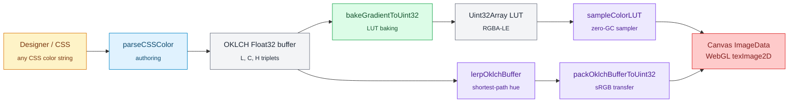
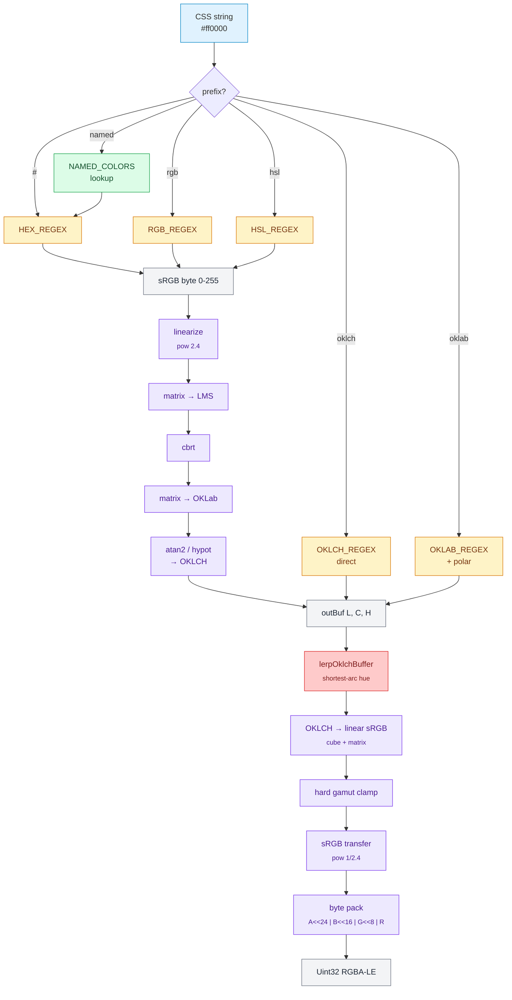

# @zakkster/lite-color-engine

[](https://www.npmjs.com/package/@zakkster/lite-color-engine)
[](https://github.com/sponsors/PeshoVurtoleta)
[](https://bundlephobia.com/result?p=@zakkster/lite-color-engine)
[](https://www.npmjs.com/package/@zakkster/lite-color-engine)
[](https://www.npmjs.com/package/@zakkster/lite-color-engine)


[](./LICENSE.md)

## 🎨 What is lite-color-engine?

**[→ Demo](https://cdpn.io/pen/debug/RNoaNmQ)**

`@zakkster/lite-color-engine` is the **OKLCH color pipeline** for the Lite ecosystem. You hand it any CSS color string — `#ff0000`, `rgb(255 0 0)`, `oklch(60% 0.15 250)`, `rebeccapurple` — and you get back a perceptually-uniform `Float32Array` triplet you can interpolate, bake into a LUT, or pack to `Uint32` for direct `ImageData` / WebGL upload.

The library splits the work along the only axis that matters for hot-path rendering: **when**.

- 🟢 **Authoring layer** — `parseCSSColor()` and friends. Runs once at init. Allocations are fine here. CSS Color Level 4 permissive. Output is always a packed `[L, C, H]` triplet at an offset you control.
- 🔵 **LUT layer** — `bakeGradientToUint32()`. Runs once at gradient compile. Multi-stop OKLCH input, optional easing, fixed-resolution `Uint32Array` output ready for `texImage2D` or a `Uint32Array` view of `ImageData`.
- 🔴 **Runtime layer** — `lerpOklchBuffer()`, `packOklchBufferToUint32()`, `sampleColorLUT()`. Zero allocations on the hot path. Zero closures. Branch-clamped, SoA-friendly, V8-monomorphic.

The split is the whole point. Every existing color library hands you an object per call. **Sub-2KB min+gzip. One peer dependency** (`@zakkster/lite-lerp`).

## 🧬 Where it fits

`lite-color-engine` is the **color pipeline kernel** of the zero-GC rendering stack — the bridge between human-authored CSS colors and per-frame `Uint32` pixel writes:



Every layer is independent. You can use just the parser. You can hand-author OKLCH buffers and skip the parser entirely. You can sample baked LUTs without ever touching `lerpOklchBuffer`. No framework lock-in, no global state.

## 🚀 Install

```bash
npm install @zakkster/lite-color-engine
```

## 🕹️ Quick Start

### Authoring — parse once, store forever

```js
import { parseCSSColor } from '@zakkster/lite-color-engine';

// Pre-allocate the entire palette as one contiguous buffer.
// Each color is 3 floats: [L, C, H].
const palette = new Float32Array(3 * 4);
const alphas  = new Float32Array(4);

alphas[0] = parseCSSColor('#ff0000',                   palette, 0);   // hex
alphas[1] = parseCSSColor('rgba(0, 200, 100, 0.5)',    palette, 3);   // rgb
alphas[2] = parseCSSColor('oklch(60% 0.15 250)',       palette, 6);   // oklch
alphas[3] = parseCSSColor('rebeccapurple',             palette, 9);   // named
```

That `Float32Array` is now your color storage for the rest of the program. No object headers, no GC pressure, perfectly cache-friendly.

### Runtime — interpolate and pack with zero allocations

```js
import { lerpOklchBuffer, packOklchBufferToUint32 } from '@zakkster/lite-color-engine';

const tempColor = new Float32Array(3); // single scratch buffer for the program lifetime

// Tween color 0 → color 2 over time, packing for ImageData.
function tick(t) {
    lerpOklchBuffer(palette, 0, palette, 6, t, tempColor, 0);
    return packOklchBufferToUint32(tempColor, 0, 1.0);
}

// Inside your render loop:
const u32 = tick(progress);
imageDataU32View[pixelIndex] = u32;   // direct write — no string parsing, no Color object
```

### LUT — bake a gradient once, sample forever

```js
import { bakeGradientToUint32, sampleColorLUT } from '@zakkster/lite-color-engine';

// Three-stop gradient: red → gold → blue
const stops = new Float32Array(9);
parseCSSColor('#ff0000', stops, 0);
parseCSSColor('#ffd700', stops, 3);
parseCSSColor('#0000ff', stops, 6);

const lut = bakeGradientToUint32(stops, 3, 256);   // 256-entry Uint32Array

// Hot path: zero allocations, zero allocations, zero allocations.
function colorAt(t) {
    return sampleColorLUT(lut, t);
}
```

## 🧠 Why this exists

CSS color is a string-first API. Every existing color library (`color`, `colord`, `culori`, `chroma-js`) treats this seriously: it gives you an object you call methods on. That's correct for tooling. It's wrong for **rendering**.

A 60fps loop with 10,000 particles allocates 600,000 color objects per second if each particle calls `.mix()` or `.toRgb()`. Even if each object is 100 bytes, you've handed the GC 60MB/sec of churn. The frame time isn't the math — it's the major GC pause.

`lite-color-engine` solves this by **separating the parse from the use**:

1. **Authoring time** (once, off the critical path): expand CSS strings into a flat `Float32Array` of OKLCH triplets. Allocate the buffer yourself, at the size you want. Done.
2. **Runtime** (every frame, every particle): pure scalar math against that buffer. Lerp two triplets into a third. Pack a triplet to `Uint32`. Sample a baked LUT by `t`. Zero allocations, zero closures, zero indirection.

The buffer-and-offset API is the contract. It looks like a C-style API in JavaScript because that's what zero-GC actually means — you control the memory, the library reads and writes it.

### Why OKLCH

Linear RGB interpolation is fast but **wrong**: red → blue passes through muddy purple-gray at the midpoint because RGB isn't perceptually uniform. HSL/HSV are perceptually uniform in name only — the saturation axis interacts non-linearly with lightness. OKLCH (Björn Ottosson, 2020) is the modern fix: hue, chroma, and lightness are independently meaningful, and linear interpolation between any two OKLCH points stays on a perceptually smooth curve.

The library uses OKLCH as its **internal representation** so every interpolation and every gradient bake is perceptually correct by construction. Pack-to-RGBA happens only at the moment of pixel write.

## 🔥 Algorithm

The end-to-end pipeline:



**Key invariants:**

- Every parser writes exactly **3 contiguous Float32 entries** at the offset you supply: `[L, C, H]`. Alpha is returned by value, not stored in the buffer — this keeps the OKLCH stride at 3, which divides cleanly into SoA layouts.
- Hue is **always** in `[0, 360)` after a write — every parser, every lerp, every conversion canonicalizes.
- Lightness is **always** clamped to `[0, 1]` after a write.
- Chroma is **always** clamped to `[0, +∞)` — never negative.
- LUT output is **always** little-endian RGBA byte order — drop straight into a `Uint32Array` view of `ImageData.data.buffer`. No byte-swapping. No platform check (browsers are universally LE).

## 🏗️ Buffer layout

The library is uncompromising about one thing: **every color is exactly 3 contiguous Float32 entries.** No fourth slot for alpha, no padding, no per-color object. This makes the layout naturally SoA-friendly:

```
palette  : [ L0 C0 H0 | L1 C1 H1 | L2 C2 H2 | ... ]   // float32 stride = 3
alphas   : [ a0 | a1 | a2 | ... ]                     // float32 stride = 1
```

Why a separate alpha array? Because **most colors are opaque**, and packing alpha into the OKLCH stride wastes 25% of every cache line on a `1.0` constant. A separate `Float32Array` (or even `Uint8Array`) lets opaque colors skip alpha entirely, and lets you swap alpha layouts (per-color vs per-instance) without changing the color storage.

If you genuinely want premultiplied OKLCHa as a stride-4, you can — the API doesn't stop you, you just write `outBuf[offset + 3] = alpha`. The library functions only touch the first three slots.

## 📊 Comparison

| | **lite-color-engine** | culori | colord | chroma-js | hand-rolled |
|---|---|---|---|---|---|
| Bundle (min+gzip) | **<2 KB** | ~14 KB | ~7 KB | ~14 KB | depends |
| Hot-path allocations | **0** | several / call | 1 / call | several / call | usually 0 |
| OKLCH-native runtime | **yes** | yes (multi-space) | via plugin | yes | manual |
| Float32Array I/O | **yes** | no (objects) | no (objects) | no (objects) | yes |
| Bake-to-Uint32 LUT | **yes** | no | no | no | manual |
| Direct `ImageData.data.buffer` write | **yes** (LE-RGBA) | no | no | no | manual |
| CSS Color Level 4 parsing | **yes** | yes | yes | partial | manual |
| Canonical hue + lightness clamps | **yes** | yes | partial | partial | manual |
| SoA / ECS friendly | **yes** | no | no | no | yes |
| TypeScript types | **yes (full)** | yes | yes | yes | n/a |
| Framework lock-in | **none** | none | none | none | none |

`lite-color-engine` is **not** a replacement for `culori` or `colord`. It does not handle every color space, gamut mapping algorithm, or color difference metric. It does **one** thing: turn a CSS string into a per-frame allocation-free pixel writer.

## ⚙️ API

### Authoring

#### `parseCSSColor(str, outBuf, offset): number`

Universal parser. Dispatches by string prefix to the appropriate format-specific parser. Writes `[L, C, H]` at `outBuf[offset..offset+2]`.

| Param | Type | Description |
|---|---|---|
| `str` | `string` | Any CSS color: hex, named, rgb/rgba, hsl/hsla, oklch, oklab. |
| `outBuf` | `Float32Array` | Pre-allocated destination. Must have length ≥ `offset + 3`. |
| `offset` | `number` | Start index of the L, C, H triplet. |
| **Returns** | `number` | Parsed alpha in `[0, 1]`. Defaults to `1.0` when omitted in the string. |

**Throws** if `str` is not a recognized format.

Format-specific parsers (`parseHexToBuffer`, `parseRgbToBuffer`, `parseHslToBuffer`, `parseOklchToBuffer`, `parseOklabToBuffer`) have identical signatures and skip the dispatch — call directly when you know the format.

### Convert

#### `sRgbToOklchBuffer(r, g, b, outBuf, outOffset): void`

Raw sRGB-byte → OKLCH conversion. The kernel underneath the parsers. Use when you have integer RGB triplets (e.g. from canvas pixel reads) and want to skip the regex layer.

### Runtime

#### `lerpOklchBuffer(bufA, offsetA, bufB, offsetB, t, outBuf, outOffset): void`

Zero-GC OKLCH interpolation. Hue uses **shortest-path** so `350° → 10°` correctly passes through `0°` instead of taking the long way around. Source and destination buffers may alias.

| Param | Type | Description |
|---|---|---|
| `t` | `number` | Interpolation factor. Values outside `[0, 1]` extrapolate, then clamp. `NaN` propagates. |

#### `packOklchBufferToUint32(buf, offset, alpha?): number`

Encodes an OKLCH triplet to a 32-bit unsigned integer in **little-endian RGBA** byte order. Uses the proper sRGB transfer function (`pow(c, 1/2.4)`). Round-tripping `sRGB → OKLCH → here` recovers the original byte exactly (within rounding).

#### `packOklchBufferToUint32Fast(buf, offset, alpha?): number`

Faster, less-accurate sibling. Substitutes `Math.sqrt(c)` for the proper sRGB transfer. ~2× throughput on V8, with these documented costs:

- mid-gray (`#808080`) round-trips to about `#767676` (~10/255 darker)
- warm midtones (browns, golds) shift toward black

Use for ephemeral pixels (particle trails, alpha-blended sprite tints) where the round-trip identity isn't observable. **Avoid** for UI tokens, palette previews, or anywhere a designer compares the output to the input.

#### `sampleColorLUT(lut, t): number`

Zero-GC LUT sampler. Inline `t`-clamp + bitwise-truncated index — no allocations, no function calls beyond this one. Use inside particle systems, fragment-shader-style canvas loops, etc.

### LUT

#### `bakeGradientToUint32(keyframesBuf, numStops, resolution?, easeFn?, packer?): Uint32Array`

Bakes a multi-stop OKLCH gradient into a `Uint32Array` of packed RGBA-LE colors.

| Param | Type | Description |
|---|---|---|
| `keyframesBuf` | `Float32Array` | Contiguous `[L0, C0, H0, L1, C1, H1, ...]`. |
| `numStops` | `number` | Stop count; must be `≥ 2`. |
| `resolution` | `number` | LUT entry count. Default `256`. Must be `≥ 2`. |
| `easeFn` | `(t) => number` | Optional. Warps `t` before stop selection. Outputs outside `[0, 1]` are clamped. |
| `packer` | `OklchPackerFn` | Optional. Defaults to the accurate packer. Pass `packOklchBufferToUint32Fast` for ~2× bake throughput. |

**Throws** if `numStops < 2` or `resolution < 2`.

### Difference

#### `deltaEOK(bufA, offsetA, bufB, offsetB): number`

ΔE-OK color difference — Euclidean distance in OKLab between two buffered OKLCH colors. Zero allocations, pure primitive math.

Typical scale: `0.02` indistinguishable, `0.05` subtle, `0.15+` unambiguously different. Use for palette dedupe, nearest-color lookup, and contrast checks.

## 🧭 Sub-exports (v1.1)

The core surface stays sub-2 KB. Heavier optional kernels ship as separate entry points so you only pay for what you import.

### `@zakkster/lite-color-engine/gamut` — MINDE gamut mapping

CSS Color 4 chroma-reduction gamut mapping. Reduces chroma at fixed L and H until the color is inside the sRGB gamut, using bisection with a JND threshold. Fixes the visible hue shifts that the hard channel clamp produces near the gamut boundary.

```js
import {
    gamutMapToSrgbBuffer,
    packOklchBufferToUint32MINDE,
} from '@zakkster/lite-color-engine/gamut';
```

- **`gamutMapToSrgbBuffer(inBuf, inOffset, outBuf, outOffset)`** — writes a gamut-mapped `[L, C', H]` triplet. Source and destination may alias. Zero allocations on the hot path.
- **`packOklchBufferToUint32MINDE(buf, offset, alpha?)`** — accurate sibling of the core packer. `~30×` slower — belongs at LUT-build time, not per-frame. Signature-compatible with `packer` in `bakeGradientToUint32`.

### `@zakkster/lite-color-engine/remap` — palette-remap kernels

Nearest-palette-index search in OKLab, plus a one-shot RGBA8-to-recolored-Uint32 pipeline. The engine underlayment for `lite-hueforge`'s `remapImageToPalette`, and standalone-useful for retro palette quantization and palette-cycling render effects.

```js
import {
    sRgba8ToOklabBuffer,
    oklchToOklabBuffer,
    oklabToOklchBuffer,
    nearestPaletteIndexBuffer,
    remapPixelsToPalette,
} from '@zakkster/lite-color-engine/remap';
```

- **Batch converters** — `sRgba8ToOklabBuffer`, `oklchToOklabBuffer`, `oklabToOklchBuffer`. SoA, stride-3 in/out, hue canonicalized to `[0, 360)` where applicable.
- **`nearestPaletteIndexBuffer(...)`** — for each pixel in `pixelsLab`, write the index of the nearest palette color into `indicesOut` (accepts `Uint32Array`, `Uint16Array`, or `Uint8Array`). Tie-break: lowest index wins.
- **`remapPixelsToPalette(inU8, paletteLch, outU32, pixelCount, paletteCount, opts?)`** — end-to-end pipe. Alpha byte passes through unchanged. `opts.preserveLightness` searches by `(a, b)` only and synthesizes output as `(pixel.L, palette.a, palette.b)` — retains shading structure under recolor.

## ⚡ Performance characteristics

| Operation | Cost |
|---|---|
| `parseCSSColor()` — named color | regex + map lookup + sRGB→OKLCH (~30 multiplies, 3 cbrt) |
| `parseCSSColor()` — oklch direct | regex + 3 number parses (no color math) |
| `lerpOklchBuffer()` | 3 lerps, 1 modulo, 4 comparisons. Zero allocations. |
| `packOklchBufferToUint32()` | ~30 multiplies, 1 cos, 1 sin, 3 cubes, 3 `pow(_, 1/2.4)`. Zero allocations. |
| `packOklchBufferToUint32Fast()` | Same minus the 3 `pow`s, plus 3 `sqrt`. Zero allocations. |
| `sampleColorLUT()` | 2 comparisons, 1 multiply, 1 bitwise truncate, 1 array load. Zero allocations. |
| `bakeGradientToUint32()` | `resolution × (lerp + pack)`; ~25k ops for a default 256-entry LUT. **One** allocation (the output Uint32Array). |
| Hot-path allocations | **zero** across the entire runtime API |
| Module-load allocations | one `Float32Array(3)` scratch (single instance, shared) |

## 🛡️ Validation

The hot path trusts its inputs. There is no runtime validation in `lerpOklchBuffer`, `packOklchBufferToUint32`, or `sampleColorLUT` — bad data produces predictable bad output, not exceptions.

| Input | Behavior |
|---|---|
| `t < 0` or `t > 1` in lerp | Extrapolates, then output is clamped (lightness → `[0, 1]`, chroma → `[0, +∞)`) |
| `t === NaN` | NaN propagates through math; output may be `0` after clamps |
| Out-of-range OKLCH values | Pack clamps r/g/b channels to `[0, 1]` before encoding |
| Wrong-length `outBuf` in parser | Throws (`out of bounds`) only if offset is invalid; otherwise writes garbage past the buffer |
| Invalid CSS string in parser | **Throws** with a descriptive `lite-color-engine: Invalid X` error |

The asymmetry is deliberate: the parsers run at init time where exceptions are useful for catching authoring mistakes; the runtime functions run thousands of times per frame where every branch is a tax.

## 📦 TypeScript

Full TypeScript declarations in `index.d.ts`. Every public function has a single overload — no union types in the API surface, no inference puzzles.

```ts
import {
    parseCSSColor,
    lerpOklchBuffer,
    packOklchBufferToUint32,
    bakeGradientToUint32,
} from '@zakkster/lite-color-engine';
import type { OklchPackerFn } from '@zakkster/lite-color-engine';

const palette = new Float32Array(12);
const alpha: number = parseCSSColor('oklch(0.7 0.2 250)', palette, 0);
```

## 📚 LLM-friendly documentation

See `llms.txt` for a structured reference designed for AI coding assistants. Public surface, buffer layout, integration patterns, and common pitfalls in one parseable document.

## 🧩 Pairs well with

- [`@zakkster/lite-lerp`](https://www.npmjs.com/package/@zakkster/lite-lerp) — peer dependency. Provides `lerp`, `lerpAngle`, and the rest of the math primitives the runtime layer relies on.
- [`@zakkster/lite-cubic-bezier`](https://www.npmjs.com/package/@zakkster/lite-cubic-bezier) — supplies `cubicBezier(...)` easing functions you can hand directly to `bakeGradientToUint32`.
- [`@zakkster/lite-ease`](https://www.npmjs.com/package/@zakkster/lite-ease) — the Penner library. Same compatibility — pass any of the 30 functions as the `easeFn` argument.

## License

See [`LICENSE.md`](./LICENSE.md). © Zahary Shinikchiev
