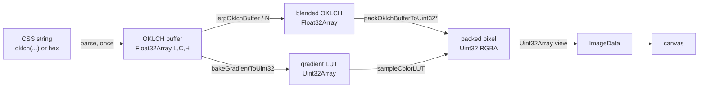

# @zakkster/lite-color-engine

> Zero-GC OKLCH color engine for hot paths. Parse once into `Float32Array` buffers, then interpolate, gamut-map, and pack straight into `ImageData` with no per-frame allocation. Built for 16ms render budgets, 100k-particle canvases, and 1MB extension bundles.

[](https://www.npmjs.com/package/@zakkster/lite-color-engine)
[](https://github.com/sponsors/PeshoVurtoleta)

[](https://bundlephobia.com/result?p=@zakkster/lite-color-engine)
[](https://www.npmjs.com/package/@zakkster/lite-color-engine)
[](https://www.npmjs.com/package/@zakkster/lite-color-engine)
[](https://coveralls.io/github/PeshoVurtoleta/lite-color-engine?branch=master)


[](./LICENSE.md)

A color library built the way a game engine is built: **no allocation on the hot path.** Colors live in flat `Float32Array` OKLCH buffers. Interpolation, gamut mapping, and packing read and write those buffers in place and emit `Uint32Array` pixels that drop directly into a canvas `ImageData`. The result is perceptually-uniform OKLCH color at the throughput of raw integer math -- **~14 million colors/second** through the LUT packer, enough to recolor a **100,000-particle** field every frame at 60fps.

It is not a wrapper around `culori` or `color.js`. There are no objects, no strings, and no garbage per frame. The one thing it depends on is [`@zakkster/lite-lerp`](https://www.npmjs.com/package/@zakkster/lite-lerp).

```bash
npm install @zakkster/lite-color-engine
```

```js
import {
  parseCSSColor,
  lerpOklchBuffer,
  packOklchBufferToUint32
} from "@zakkster/lite-color-engine";

const a = new Float32Array(3);
const b = new Float32Array(3);
const t = new Float32Array(3);           // scratch, allocated once

parseCSSColor("oklch(0.72 0.15 30)", a, 0);   // warm
parseCSSColor("oklch(0.66 0.18 265)", b, 0);  // cool

// Per frame, zero allocations:
lerpOklchBuffer(a, 0, b, 0, 0.5, t, 0);       // perceptual midpoint (shortest-hue)
const pixel = packOklchBufferToUint32(t, 0);  // 0xAABBGGRR for a Uint32Array/ImageData
```

Perceptually-uniform blends, correct sRGB output, no heap traffic. That is the whole pitch.

---

## Table of contents

- [Why this exists](#why-this-exists)
- [What you get](#what-you-get)
- [The buffer model](#the-buffer-model)
- [The pipeline in one diagram](#the-pipeline-in-one-diagram)
- [Accuracy tiers](#accuracy-tiers)
- [Batch kernels and the 100k particle case](#batch-kernels-and-the-100k-particle-case)
- [Benchmarks](#benchmarks)
- [API reference](#api-reference)
- [Wide gamut (Display P3)](#wide-gamut-display-p3)
- [Gamut mapping (`/gamut`)](#gamut-mapping-gamut)
- [Palette remap (`/remap`)](#palette-remap-remap)
- [Formatters](#formatters)
- [Allocation profile](#allocation-profile)
- [Tree-shaking and subpaths](#tree-shaking-and-subpaths)
- [Testing](#testing)
- [Integration recipes](#integration-recipes)
- [Browser and runtime support](#browser-and-runtime-support)
- [What this is not](#what-this-is-not)
- [FAQ](#faq)

---

## Why this exists

Color work in animation loops has a hidden cost: most libraries allocate. A `culori` blend returns a fresh object; a `color.js` conversion builds intermediate arrays; `hsl()` string interpolation allocates strings. One color is nothing. Sixty thousand colors, sixty times a second, is a GC storm that shows up as jank on exactly the frames you care about.

`lite-color-engine` was written under three constraints at once:

1. **No allocation after warm-up.** Parsing and LUT baking allocate; the per-frame path -- lerp, pack, sample -- touches no heap. All scratch is caller-owned `Float32Array`.
2. **Perceptually uniform by default.** Interpolation happens in OKLCH, so a red-to-blue gradient doesn't muddy through gray and lightness stays even. Hue takes the shortest path around the wheel.
3. **Output that's actually correct.** The default packer uses the true IEC 61966-2-1 sRGB transfer, so `#rrggbb -> OKLCH -> pack` round-trips to within 1 LSB. Faster, looser tiers are opt-in, never the default.

OKLCH is the right space for interpolation. Flat typed arrays are the right representation for throughput. This library is the intersection.

---

## What you get

**Parse (authoring-time)**
- `parseCSSColor(str, out, off)` -- universal: hex, `rgb()/rgba()`, `hsl()/hsla()`, `oklch()`, `oklab()`, `color(display-p3 ...)`, and 140+ named colors.
- `parseHexToBuffer`, `parseRgbToBuffer`, `parseHslToBuffer`, `parseOklchToBuffer`, `parseOklabToBuffer`, `parseDisplayP3ToBuffer` -- direct parsers when you already know the format.

**Interpolate (hot path)**
- `lerpOklchBuffer(a, offA, b, offB, t, out, off)` -- one perceptual blend, shortest-path hue.
- `lerpOklchBufferN(a, offA, b, offB, t, out, off, n)` -- bulk blend of `n` triplets, one call.

**Pack to pixels (hot path)**
- `packOklchBufferToUint32(buf, off, alpha?)` -- accurate sRGB, round-trip exact.
- `packOklchBufferToUint32Fast(buf, off, alpha?)` -- `sqrt` approximation, ~2x, ~10/255 drift.
- `packOklchBufferToUint32IntoN(src, offSrc, dst, offDst, n, alpha?, useLut?)` -- bulk pack `n` colors into a `Uint32Array`; `useLut` swaps in a 4k transfer LUT (~4x, within 1 LSB).
- `packOklchBufferToUint32P3` / `...P3Fast` -- Display P3 output.

**Bake and sample (hot path)**
- `bakeGradientToUint32(keyframes, numStops, resolution?, easeFn?, packer?)` -- pre-render a gradient into a `Uint32Array` LUT once.
- `sampleColorLUT(lut, t)` -- branch-light O(1) lookup, no allocation.

**Format (authoring-time)**
- `formatOklchCss(buf, off, alpha?)` -- back to `oklch(60.0% 0.150 250.0)`.
- `formatHex(buf, off)` -- back to `#rrggbb`.

**Measure**
- `deltaEOK(a, offA, b, offB)` -- perceptual color difference (Euclidean in OKLab).

**Subpaths (opt-in, tree-shaken separately)**
- `@zakkster/lite-color-engine/gamut` -- MINDE gamut mapping.
- `@zakkster/lite-color-engine/remap` -- palette quantization for whole pixel buffers.

Full types ship in [`index.d.ts`](./index.d.ts); every public symbol has JSDoc.

---

## The buffer model

A color is three `Float32` lanes -- **L, C, H** -- somewhere in a `Float32Array` you own. That's it. There is no `Color` class.

```js
// Store 1,000 colors in one flat buffer (Structure-of-Arrays friendly).
const colors = new Float32Array(1000 * 3);
parseCSSColor("crimson", colors, 42 * 3);   // write color #42 at offset 126
```

Every function takes `(buffer, offset)` pairs, so the same three functions work on a single color, a gradient row, or a 100k-particle system -- no per-color wrapper object is ever created. Packers emit a 32-bit integer in **little-endian RGBA** byte order, which is exactly the layout a `Uint32Array` view of a canvas `ImageData` expects:

```js
const img = ctx.createImageData(w, h);
const px  = new Uint32Array(img.data.buffer);   // px[i] = one pixel
px[i] = packOklchBufferToUint32(colors, i * 3); // write directly, no copy
ctx.putImageData(img, 0, 0);
```

---

## The pipeline in one diagram



Everything left of `E` is `Float32`; everything from `E` right is integer pixels. The boundary is a single pack call. No object crosses it.

---

## Accuracy tiers

The same OKLCH triplet can be packed several ways. Pick the trade-off per workload:

| Tier | Function | Transfer | Speed (100k) | Error vs exact | Use when |
|---|---|---|---|---|---|
| **Fast** | `packOklchBufferToUint32Fast` | `sqrt` approx | ~fastest | ~10/255 midtone | huge counts, alpha-blended over content |
| **Accurate** | `packOklchBufferToUint32` | true sRGB `pow` | baseline (~3M/s) | exact (round-trips) | correctness, exports, single colors |
| **LUT** | `packOklchBufferToUint32IntoN(..., true)` | 4096-entry LUT | **~4x accurate (~14M/s)** | <= 1 LSB | 100k/frame, batched |
| **P3** | `packOklchBufferToUint32P3` / `Fast` | P3 primaries | ~accurate / ~fast | -- | `display-p3` canvas contexts |
| **Gamut** | `packOklchBufferToUint32MINDE` (`/gamut`) | chroma reduction | slowest | hue-preserving | vivid OKLCH that overflows sRGB |

The **LUT tier gives you Fast-packer speed at Accurate-packer quality** -- it is the one to reach for in particle systems.

---

## Batch kernels and the 100k particle case

v1.3 added buffer-to-buffer kernels for the shape a particle system actually has: one big SoA buffer in, one big pixel buffer out.

```js
import { lerpOklchBufferN, packOklchBufferToUint32IntoN } from "@zakkster/lite-color-engine";

const N = 100_000;
const from = new Float32Array(N * 3);
const to   = new Float32Array(N * 3);
const cur  = new Float32Array(N * 3);
const px   = new Uint32Array(N);          // -> Uint32Array view of ImageData

// Per frame, zero allocations:
lerpOklchBufferN(from, 0, to, 0, t, cur, 0, N);
packOklchBufferToUint32IntoN(cur, 0, px, 0, N, 1.0, /* useLut */ true);
```

**An honest note on where the speed comes from.** The batch functions are mostly an *ergonomics* win, not a raw-throughput win: in V8 a clean monomorphic scalar loop inlines about as well as a hand-batched call, so accurate batch packing runs at the same speed as a scalar loop, and batch lerp is break-even. **The real win is `useLut: true`**, which removes `pow()` from the hot path. Everything below is measured, and the ratios -- not the absolute milliseconds -- are what to trust across machines.

---

## Benchmarks

Reproduce with `node bench/benchmark.mjs` (median of 80 runs, 100k in-gamut triplets):

| Packing 100k OKLCH -> Uint32 / frame | Throughput | ms/frame |
|---|---|---|
| scalar loop / batch accurate | ~3.2M/s | ~31 ms |
| **batch + `useLut: true`** | **~13-14M/s** | **~7 ms** |
| Fast (`sqrt`, ~10/255 error) | ~15M/s | ~7 ms |

**What holds across machines (the safe headlines):**
- LUT packing is **~4x** the accurate path.
- LUT is **within 1 LSB** of exact -- i.e. *Fast-packer speed at Accurate-packer quality*.
- Batching **by itself** is a wash (lerp ~1.0x, accurate pack ~1.0x); both are `pow`-bound, not call-bound.
- 100k lerp+pack fits a 60fps frame budget **only with the LUT** (~10 ms vs ~35 ms accurate).

Absolute milliseconds vary by device; the benchmark prints your machine's numbers and a paste-ready table.

---

## API reference

### Parsing

```ts
parseCSSColor(str: string, out: Float32Array, off: number): number; // returns alpha
parseHexToBuffer(str, out, off): number;
parseRgbToBuffer(str, out, off): number;
parseHslToBuffer(str, out, off): number;
parseOklchToBuffer(str, out, off): number;
parseOklabToBuffer(str, out, off): number;
parseDisplayP3ToBuffer(str, out, off): number;
```

Each writes `[L, C, H]` at `out[off..off+2]` and returns the parsed alpha (`1.0` when absent). `parseCSSColor` sniffs the format and dispatches. Parsing allocates (regex, temporaries) and is meant for setup, not the frame loop.

### Interpolation

```ts
lerpOklchBuffer(a, offA, b, offB, t: number, out, off): void;
lerpOklchBufferN(a, offA, b, offB, t: number, out, off, n: number): void;
```

Lightness clamps to `[0,1]`, chroma to `[0, +inf)`, hue takes the **shortest path** and is canonicalized to `[0, 360)`. `lerpOklchBufferN` shares one `t` across `n` triplets and is bit-for-bit identical to `n` scalar calls. In-place safe.

### Packing

```ts
packOklchBufferToUint32(buf, off, alpha = 1): number;      // accurate sRGB
packOklchBufferToUint32Fast(buf, off, alpha = 1): number;  // sqrt approx
packOklchBufferToUint32IntoN(src, offSrc, dst, offDst, n, alpha = 1, useLut = false): void;
packOklchBufferToUint32P3(buf, off, alpha = 1): number;    // Display P3
packOklchBufferToUint32P3Fast(buf, off, alpha = 1): number;
```

All return (or write) a 32-bit integer in little-endian RGBA order, hard-clamped to gamut. `IntoN` writes `n` pixels into `dst` at stride 1.

### Gradient LUT

```ts
bakeGradientToUint32(
  keyframes: Float32Array,   // contiguous [L0,C0,H0, L1,C1,H1, ...]
  numStops: number,          // >= 2
  resolution = 256,          // >= 2
  easeFn?: (t: number) => number,
  packer = packOklchBufferToUint32
): Uint32Array;

sampleColorLUT(lut: Uint32Array, t: number): number; // O(1), clamped, no alloc
```

Bake once (uses `lerpOklchBuffer` internally, so gradients are perceptual and hue-correct), then `sampleColorLUT` in the loop. Pass a custom `packer` to bake a P3 or gamut-mapped LUT.

### Difference

```ts
deltaEOK(a, offA, b, offB): number; // Euclidean distance in OKLab
```

---

## Wide gamut (Display P3)

Parse `color(display-p3 ...)` and pack for a P3 canvas context. Colors outside sRGB but inside P3 keep their saturation.

```js
const c = new Float32Array(3);
parseCSSColor("color(display-p3 0.9 0.2 0.35)", c, 0);

const ctx = canvas.getContext("2d", { colorSpace: "display-p3" });
const img = ctx.createImageData(w, h, { colorSpace: "display-p3" });
const px  = new Uint32Array(img.data.buffer);
px[i] = packOklchBufferToUint32P3(c, 0);
```

P3 is strictly opt-in. The default sRGB path and bundle are untouched if you never import the P3 packers.

---

## Gamut mapping (`/gamut`)

Vivid OKLCH colors can fall outside sRGB. The default packers hard-clamp (fast, can shift hue). For hue-preserving results, the `/gamut` subpath does **MINDE** (minimum-delta-E) chroma reduction -- it walks chroma down until the color fits, keeping lightness and hue.

```js
import { packOklchBufferToUint32MINDE, gamutMapToSrgbBuffer } from "@zakkster/lite-color-engine/gamut";

const px = packOklchBufferToUint32MINDE(buf, 0);        // pack with gamut mapping
gamutMapToSrgbBuffer(inBuf, 0, outBuf, 0);              // or map in OKLCH space
```

`gamutMapToSrgbBuffer` is `@zakkster/lite-lerp`-free and self-contained, so the subpath loads standalone.

---

## Palette remap (`/remap`)

Quantize a whole RGBA8 pixel buffer to a fixed palette using perceptual (OKLab) nearest-color -- for dithering-free posterization, theming, and retro/CRT looks.

```js
import { remapPixelsToPalette } from "@zakkster/lite-color-engine/remap";

// paletteLch: Float32Array of [L,C,H] triplets; inU8: RGBA8 pixels; outU32: packed result
remapPixelsToPalette(inU8, paletteLch, outU32, pixelCount, paletteCount, opts);
```

Lower-level building blocks are exported too: `sRgba8ToOklabBuffer`, `oklchToOklabBuffer`, `oklabToOklchBuffer`, `nearestPaletteIndexBuffer`.

---

## Formatters

Round-trip OKLCH buffers back to CSS for exports, design tools, and telemetry (authoring-time; they allocate a string).

```js
import { formatOklchCss, formatHex } from "@zakkster/lite-color-engine";

const b = new Float32Array(3);
parseCSSColor("#3fa9c8", b, 0);
formatOklchCss(b, 0);       // "oklch(68.7% 0.105 221.0)"
formatOklchCss(b, 0, 0.8);  // "oklch(68.7% 0.105 221.0) / 0.800"
formatHex(b, 0);            // "#3fa9c8"
```

`formatHex` uses the accurate pack path, so it round-trips with `parseHexToBuffer` to within 1 LSB. Alpha is emitted only when supplied and below 1.

---

## Allocation profile

Honest accounting of where memory is spent:

| Operation | Allocates | Per-frame allocation |
|---|---|---|
| `parseCSSColor` / `parse*` | regex + temporaries | (setup only) |
| `bakeGradientToUint32` | one `Uint32Array` LUT | (setup only) |
| `formatOklchCss` / `formatHex` | one string | (authoring only) |
| `lerpOklchBuffer` / `N` | -- | **0** |
| `packOklchBufferToUint32*` | -- | **0** |
| `packOklchBufferToUint32IntoN` | -- | **0** |
| `sampleColorLUT` | -- | **0** |
| `deltaEOK` | -- | **0** |

The 4k sRGB LUT behind `useLut` is a single module-load allocation, shared process-wide.

---

## Tree-shaking and subpaths

`sideEffects: false`, pure ESM. Import only what you touch and the rest never enters your bundle. Wide-gamut mapping and palette remap live behind subpaths so they cost nothing unless imported:

```js
import { lerpOklchBuffer } from "@zakkster/lite-color-engine";          // core
import { packOklchBufferToUint32MINDE } from "@zakkster/lite-color-engine/gamut";
import { remapPixelsToPalette } from "@zakkster/lite-color-engine/remap";
```

One runtime dependency: [`@zakkster/lite-lerp`](https://www.npmjs.com/package/@zakkster/lite-lerp) (zero-dep itself).

---

## Testing

117 tests across 7 files (`node --test` via Vitest):

- **Parsing / authoring** -- every format, named colors, alpha, malformed input.
- **Convert** -- sRGB and P3 round-trips against reference math.
- **Runtime** -- pack byte order, transfer accuracy, `Fast` error bounds.
- **Batch** -- `lerpOklchBufferN` and `packOklchBufferToUint32IntoN` proven **bit-for-bit** equal to scalar loops; LUT within 1 LSB.
- **Formatters** -- hex/OKLCH round-trip, alpha rules, buffer purity.
- **Gamut / Remap** -- MINDE hue preservation, palette nearest-color.
- **DeltaE** -- perceptual difference against known pairs.

```bash
npm test            # full suite
node bench/benchmark.mjs   # reproduce the perf numbers
```

---

## Integration recipes

### Scrolling canvas gradient (zero-GC)

```js
import { bakeGradientToUint32, sampleColorLUT, parseCSSColor } from "@zakkster/lite-color-engine";

const stops = ["oklch(0.7 0.18 30)", "oklch(0.8 0.2 120)", "oklch(0.65 0.2 265)"];
const kf = new Float32Array(stops.length * 3);
stops.forEach((s, i) => parseCSSColor(s, kf, i * 3));
const lut = bakeGradientToUint32(kf, stops.length, 512);

function frame(t) {
  for (let x = 0; x < w; x++) {
    px[x] = sampleColorLUT(lut, (x / w + t * 0.0002) % 1);
  }
  for (let y = 1; y < h; y++) px.copyWithin(y * w, 0, w); // replicate row
  ctx.putImageData(img, 0, 0);
  requestAnimationFrame(frame);
}
```

### 100k particles colored by life

```js
import { bakeGradientToUint32, sampleColorLUT } from "@zakkster/lite-color-engine";

const lut = bakeGradientToUint32(kf, kf.length / 3, 256);
function render() {
  px.fill(0xFF000000);                            // px = Uint32Array view of ImageData
  for (let i = 0; i < N; i++) {
    const color = sampleColorLUT(lut, life[i] / maxLife[i]);
    px[(partY[i] | 0) * w + (partX[i] | 0)] = color;   // direct pixel write
  }
  ctx.putImageData(img, 0, 0);
}
```

(A full oscilloscope-themed demo with this scene ships in `demo/index.html` -- run `npx serve .` from the package root.)

---

## Browser and runtime support

<details>
<summary>Support matrix.</summary>

Pure ES2020 typed arrays + `Math`. Runs anywhere modern JS runs.

| Target | Supported |
|---|---|
| Chrome / Edge (last 2 majors) | yes |
| Firefox (last 2 majors) | yes |
| Safari 15+ | yes |
| Node.js 18+ | yes |
| Bun / Deno | yes |
| Twitch Extensions (1MB / 3s) | yes |
| Cloudflare Workers | yes |

Display-P3 canvas output additionally needs a browser with `{ colorSpace: "display-p3" }` support (Chrome/Safari). ESM-only; no CommonJS build.

</details>

---

## What this is not

- **Not a `Color` object library.** No class, no method chaining. If you want `color("red").lighten(0.1).hex()`, use `culori` or `color.js`; they allocate, and for authoring that's fine.
- **Not a CSS engine.** It parses the color grammar it needs, not `calc()`, relative color syntax, or `color-mix()`.
- **Not a full ICC color-management stack.** It handles sRGB and Display P3. No CMYK, no arbitrary ICC profiles.
- **Not a renderer.** It produces pixels; you own the canvas, the loop, and the physics.

---

## FAQ

**Why OKLCH and not HSL or Lab?** HSL interpolation muddies and shifts lightness; Lab hue paths are awkward. OKLCH is perceptually uniform *and* has a natural hue axis, so gradients stay clean and even.

**Why `Float32Array` instead of objects?** Objects allocate and pointer-chase. Flat arrays are cache-friendly and let the same function serve one color or a million. It's the difference between 3M and jank, and 14M and smooth.

**Is the `Fast` packer wrong?** It's approximate -- `sqrt` instead of the sRGB transfer, ~10/255 in midtones. Fine when the pixel is alpha-blended over arbitrary content; not for exact round-trips. Use the LUT tier if you want speed *and* accuracy.

**Do I have to manage buffers myself?** Yes -- that's the point. You allocate scratch once at setup and reuse it. The library never allocates behind your back on the frame path.

**Does `useLut` change my output?** By at most 1 LSB per channel versus the exact packer -- imperceptible, and it removes `pow()` from the loop for ~4x throughput.

---

## License

MIT (c) Zahary Shinikchiev. See [LICENSE.md](./LICENSE.md).
